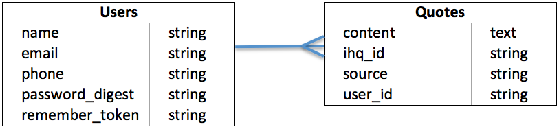

#Chris' GitHub README for 'quotely'   

##General Assembly Web Development Immersive (WDI) - Fall 2014, Project 1

##Overview

Quotely is a web application that allows users to receive entertaining quotes from Calvin and Hobbes, Star Wars, and Forrest Gump - which are referred to as the 'classics' in this app. Users can compile a list of their favorite quotes by saving them to their profile page. The app leverages the IHeartQuotes API to generate the quotes and the Twilio API to handle text messaging features.

Quotely was developed for a project for the Fall 2014 Web Development Immersive course at General Assembly. It was developed over a week-long sprint to model the agile software development process. The GitHub for quotely is available [here](https://github.com/cmarkel5/quotely_app).

##Technologies Used
* Ruby 2.1.3
* Rails 4.1.6
* Bootstrap 3.2.0
* PostgreSQL Database
* Authentication & Authorization from scratch using [bcrypt-ruby](https://github.com/codahale/bcrypt-ruby)
* [Twilio API](https://www.twilio.com/api), [IHeartQuotes API](http://iheartquotes.com/api), & [HTTParty](https://github.com/jnunemaker/httparty)
* Testing using [rspec-rails](https://github.com/rspec/rspec-rails), [capybara](https://github.com/jnicklas/capybara), and [factory_girl_rails](https://github.com/thoughtbot/factory_girl_rails)

##User Stories Completed
* As a user, I can sign up for an account with an email address and password
* As a user, I can sign in and sign out of my account
* As a user, I can generate quotes from Calvin and Hobbes, Star Wars, and Forrest Gump
* As an authenticated user, I can add my favorite quotes to my profile page
* As an authenticated user, I can view my profile and see a list of my favorite quotes
* As an authenticated user, I can delete quotes from my profile page
* As an authenticated user with a gravatar account, I can see a picture of myself on my profile page
* As an authenticated user, I can receive a welcome text
* As an authenticated user, I can receive a random daily quote

##Production
Explore quotely for yourself on [Heroku](https://quotelyy.herokuapp.com/).

##Backlog
A full list of user stories can be found on this [Trello Board](https://trello.com/b/lY67W3wk/quotely-project-1). A mockup of the app is available [here](https://moqups.com/#!/edit/cmarkel5/ku081S55).

Below is the ERD for quotely.

